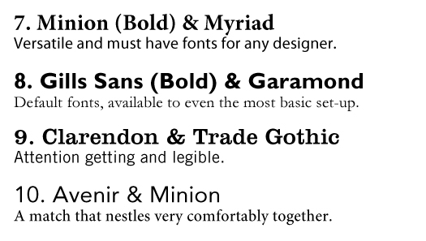
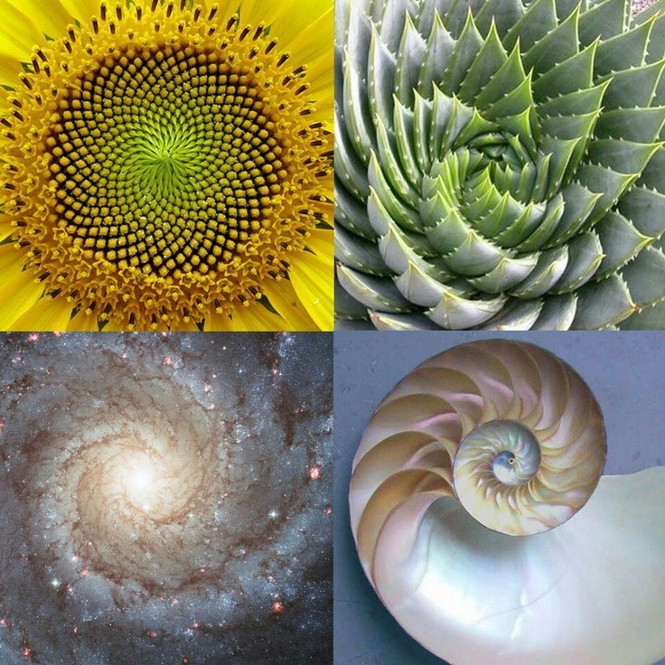
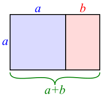
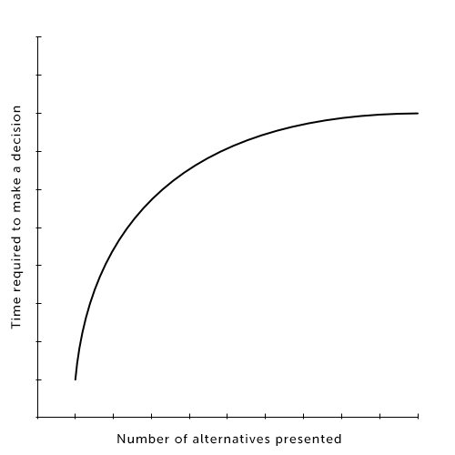
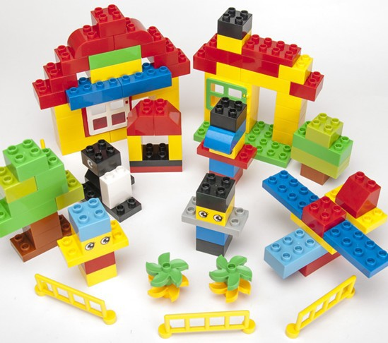

# Principles of Design

> :construction: This documentation is WIP ok?

* [Simplicity](#simplicity)
* [Typography](#typography)
* [Color](#color)
* [The Fibbonacci sequence](#the-fibbonacci-sequence)
* [Golden ratio](#golden-ratio)
* [Hick's Law](#hicks-law)
* [Modularity](#modularity)
* [Ockham's razor](#ockhams-razor)
* [Picture superiority effect](#picture-superiority-effect)
* [Rule of thirds](#rule-of-thirds)
* [Signal to noise ratio](#signal-to-noise-ratio)
* [The von Restorff effect](#the-von-restorff-effect)
* [Figure-ground relationship](#figure-ground-relationship)
* [Form follows function](#form-follows-function)
* [Interferences](#interferences)

## Simplicity

> The [Zen of Python](http://www.thezenofpython.com/)
>
* Beautiful is better than ugly.
* Explicit is better than implicit.
* Simple is better than complex.
* Complex is better than complicated.
* Flat is better than nested.
* Sparse is better than dense.
* Readability counts.
* Special cases aren't special enough to break the rules. Although practicality beats purity.
* Errors should never pass silently. Unless explicitly silenced.
* In the face of ambiguity, refuse the temptation to guess. There should be one-- and preferably only one --obvious way to do it. Although that way may not be obvious at first unless you're Dutch.
* Now is better than never. Although never is often better than *right* now.
* If the implementation is hard to explain, it's a bad idea.
* If the implementation is easy to explain, it may be a good idea.

  [ http://vanseodesign.com/web-design/simplicity/](http://vanseodesign.com/web-design/simplicity/)
## Typography
In your designs(Fab Academy Slide, Fab Academy documentation, posters, etc.) take care of your typography. Use services like [http://fontpair.co/](http://fontpair.co/) to select two fonts that pair well.

> Select a font pair for your final project slide.

## Color

* Number of colors 2, 3, 4
* [Harmony](https://zevendesign.com/color-harmony-hulk-wears-purple-pants/)
* Saturation
* Simbolism

> Select a color palette for your poster, website, and product. Why did you chose those colors?

## The Fibonacci sequence

The Fibonacci Sequence is a series of numbers where the next number is found by adding up the two numbers before it.

`0, 1, 1, 2, 3, 5, 8, 13, 21, 34, ...`

Fibonacci sequence can be used to obtain a spiral.

Nature uses Fibonacci sequences in self-similar grow patterns. Patterns that grow but maintain the same shape or proportion.

When you need to create grow patterns and spiral design, remember the Fibonacci sequence.

## Golden ratio

The golden ratio is one where the ratio of the smaller segment to the larger segment is the same as the larger segment to the sum of both segments.

Whether we’ve been genetically programmed to like them or we find them pleasing due to all the examples around us, the golden section has a strong relationship with the perception of beauty.

* You can use the golden ration when creating a grid for your design
* To establish the relationship between sizes of two elements

The mathematics behind the golden ratio is heavily connected to the Fibonacci Sequence. If you take any number n in the sequence and divide it by the previous number n-1 the result approximates Phi or the golden ratio as n tends to infinity.

## Hick's Law

Hick's law describes the time it takes for a person to make a decision as a result of the possible choices he or she has. The decision time increases logarithmically with the number of choices.

Take Hick's Law into account when you are designing a UX, specially if the time to take a decision is important.

## Modularity

Modularity is a very powerful design principle. It is a key factor in supporting resilience.

## Ockham's razor

Among competing hypotheses, the one with the fewest assumptions should be selected.

## Picture superiority effect

The picture superiority effect refers to the phenomenon in which pictures and images are more likely to be remembered than words. Use this principle if you want to remark principles.

## Rule of thirds

The rule of thirds is a guideline applied to the process of composing visual designs which proposes that an image should be divided into nine equal parts by two equally spaced horizontal lines and two equally spaced vertical lines, and that important compositional elements should be placed along these lines or their intersections.

## Signal to noise ratio

In analog and digital communication signal-to-noise ratio (S/N or SNR) is a measure of the signal strength that is received relative to the background noise that is also received

## The von Restorff effect

The von Restorff effect predicts that when multiple homogeneous stimuli are presented, the stimulus that differs from the rest is more likely to be remembered.

## Figure-ground relationship

## Form follows function

## Interferences

---
[Back to Summary](../summary.md)
