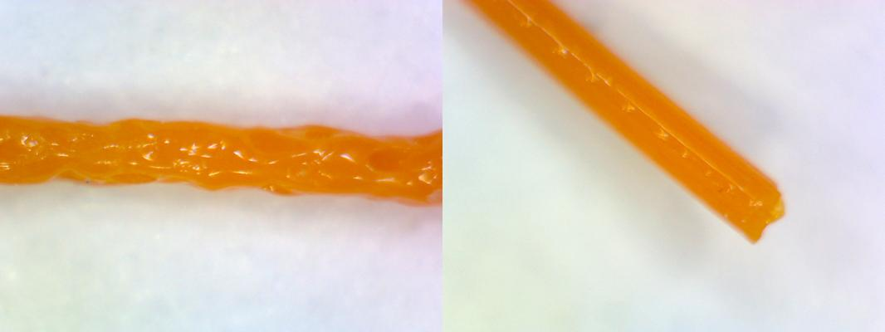

# 3D Printing

> :construction: This documentation is WIP

* [General Notes](#general-notes)
* [3D Printing](#3d-printing)
  * [Group assignment](#group-assignment)
  * [Individual assignment](#individual-assignment)

## General Notes

* File limit set to 1 Mb per file. Check file sizes `du -s * | sort -rn` 1-2 Mb week
* Clean up the archive (remove old unused students folders and files)
* Whatever you 3D print, it must be your own design. It cannot be just downloaded. You can modify other's design though, give credits in this case.
* You have to design so that it cannot be made substractively and you have to explain why.

## 3D Printing

* All students: Learn how to level the 3D printer.
* Ultimaker 2 users: Before printing, it is recommended first do the _move material_ in the Maintenance/Advanced menu. Once the nozzle is at printing temperature (around 210C) move the material using the clickwheel until the material comes out of the nozzle steady and without imperfections.

Use your USB microscope. In the image above, you can see the 0.4mm filament through the microscope. To the left you can see symptoms of a partially obtruded nozzle. If this is the case perform an [atomic clean](https://ultimaker.com/en/manuals/149-atomic-method). And the right is a good looking filament.

### Group assignment

* Find out limits of the machine. Print a test: [Thingiverse test prints](http://www.thingiverse.com/search/page:1?q=test&sa=).
* Test speed, increase speed while printing a cylinder until you reach under extrusion.
* Try lowering the temperature every cm while printing a cylinder 210 - 205 - 200 ... until you reach under extrusion.

### Individual assignment

* Design **for the machine** and not the opposite
* Design a small object (few cm). It is better to test many small objects and learning from all of them than printing a huge object.
* Host big STL files in sketchfab  TODO link
* Original design file should go in the archive

---
[Back to Summary](../summary.md)
